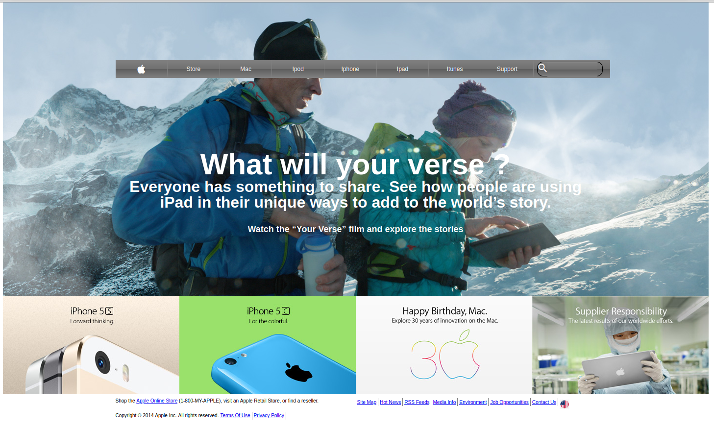

# Apple.com Page Clone

> This project consists of building a webpage using images as a background and adding gradients to elements. The goal is to make a clone of old an old version of the Apple website webpage.

Additional description about the project and its features.

## Built With

- HTML,
- CSS

To get a local copy up and running follow these simple example steps.

**Run the following command**

**git clone git@github.com:AdedayoOpeyemi/Apple.com-clone.git**

## Authors

👤 **Author1**

- Github: [Adedayoopeyemi](https://github.com/Adedayoopeyemi)
- Twitter: [@Oyelesiopy](https://twitter.com/oyelesiopy)

## 🤝 Contributing

Contributions, issues and feature requests are welcome!

Feel free to check the [issues page](issues/).

## Show your support

Give a ⭐️ if you like this project!

## Acknowledgments

- Hat tip to anyone whose code was used
- Inspiration
- etc

## 📝 License

This project is [MIT](lic.url) licensed.
